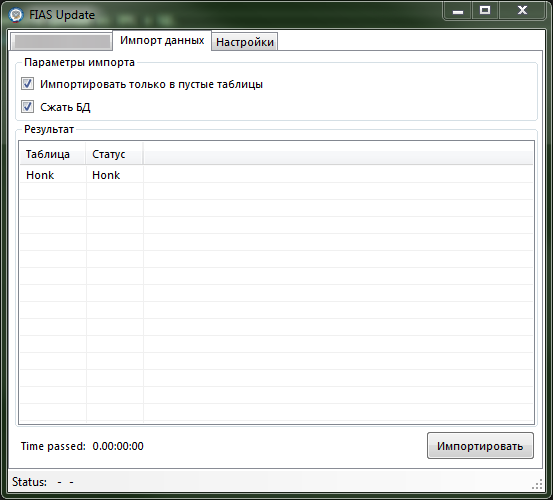
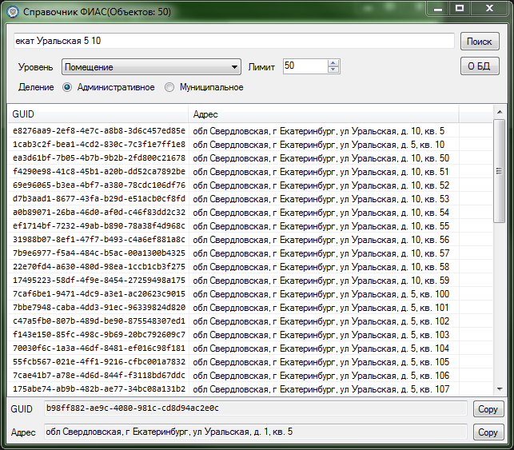

# ФИАС ГАР
Проект БД ФИАС ГАР для SQL Server и приложение для её обновления.
## FIAS_GAR
Проект БД для SQL Server.  
Изначально таблицы БД были созданы с помощью SMO на основе XSD схем (класс DBCreate в FIASUpdate), и после правки таблиц импортирована в проект. 

## FIASUpdate
Приложение для импорта данный из XML в БД.
## [Wiki](https://github.com/Virenbar/FIAS_GAR/wiki)

