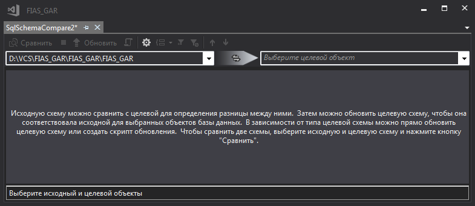

Для открытия проекта необходим [SSDT](https://docs.microsoft.com/en-us/sql/ssdt/download-sql-server-data-tools-ssdt)

## Развертывание БД

1. Открыть решение в Visual Studio
2. Создать на сервере SQL пустую базу данных **FIAS_GAR**
3. ПКМ по **FIAS_GAR** > `Собрать`
4. ПКМ по **FIAS_GAR** > `Опубликовать...`
5. Указать соединение с пустой базой данных и выполнить публикацию

## Обновление БД

1. Открыть решение в Visual Studio
2. ПКМ по **FIAS_GAR** > `Собрать`
3. ПКМ по **FIAS_GAR** > `Сравнение схем`
4. Выбрать в качестве целевого объекта базу данных **FIAS_GAR**
5. Нажать `Сравнить` для создания скрипта обновления
6. Нажать `Обновить` для применения изменений

