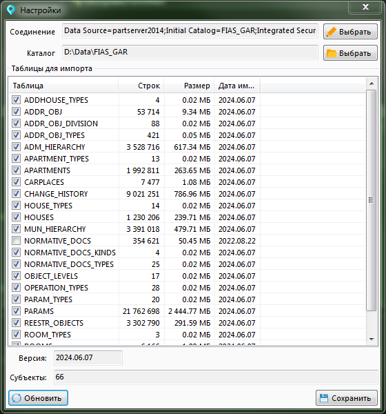
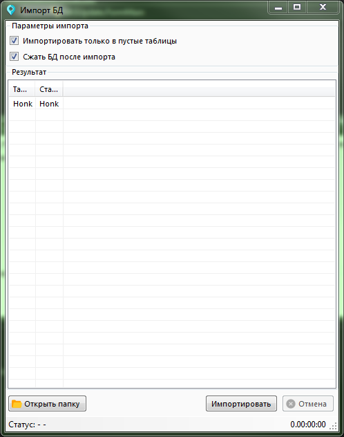
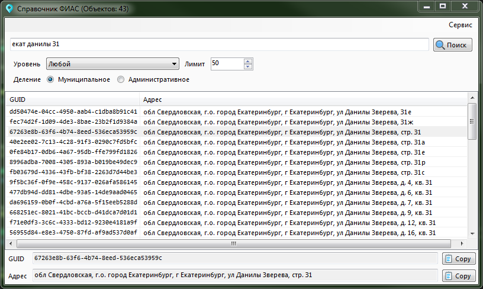

Перед началом импорта БД FIAS_GAR уже должна быть развёрнута на сервере.  
Импорт идёт напрямую в таблицы через `SqlBulkCopy` с использованием `IDataReader`.  
Обычно (у меня) скорость импорта ~1 ГБ/мин (Если сервер не нагружен).  

## Импорт данных в БД

1. Скачать архив с сайта ФИАС
2. Распаковать нужные субъекты и файлы из корня архива в `<path>\gar_xml\`
3. Указать `<path>` в настройках
4. Настроить соединение с SQL Server
5. Выбрать таблицы для импорта
6. Запустить импорт

Форма с настройками  
  
Вкладка с результатом импорта  

## Поиск адреса в БД

Пример использования `FIASStore` для поиска адреса в БД  

